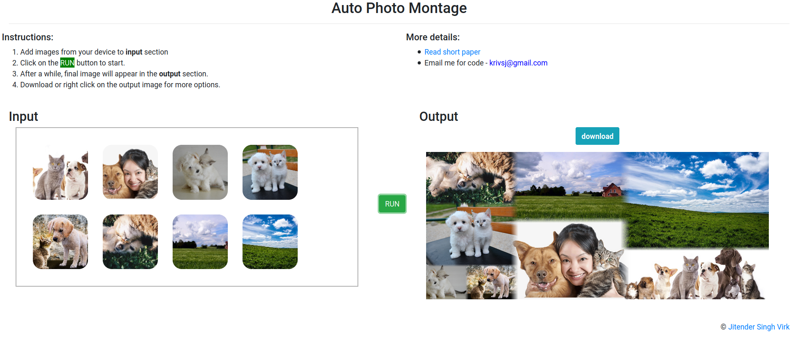

# Auto Photomontage / Collage Web App

 

This project is based on the MicroSoft research paper mentioned below. Some formulas in the implemented code is different than mentioned paper.

**Overview**: This paper describes the procedure of automated digital photomontage web app. This system aims to construct an eye-pleasing image from a collection of input images without any efforts. The system constructs a montage, also known as collage, of given images using several algorithms to identify each image’s right placement. The algorithms involve saliency detection, face detection, smooth image-to-image transition, auto-orientation, and image-borders blending.

* [**The web app is available here**](http://jsvirk47.pythonanywhere.com)

* [**Read short paper here**](https://cumailin-my.sharepoint.com/:b:/g/personal/20mai1035_cuchd_in/EW2JuFrf7o1AjjZFFbV2gD0BbAdSZrjTIPBP8h4fvoReDw?e=bEIqyv)

### WebApp Interface

### Output

**Reference**: [Microsoft AutoCollage](https://www.microsoft.com/en-us/research/wp-content/uploads/2006/08/autocollage_rotheretal_siggraph2006.pdf)
